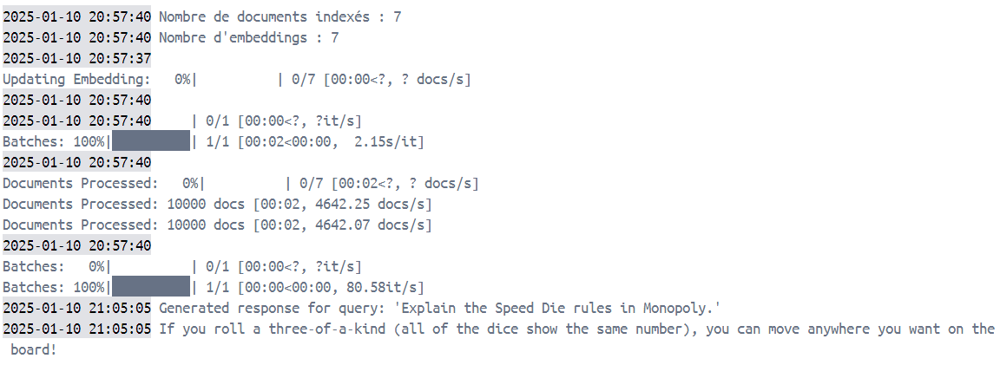

# RAG-based Question Answering System

## Description

This program implements a **Retrieval-Augmented Generation (RAG)** pipeline designed to answer questions based on document content, such as PDFs. The system combines document retrieval using **Haystack** and **Sentence Transformers**, with text generation powered by **Flan-T5**. The workflow involves extracting text from a PDF, indexing it, and retrieving relevant sections of the document to generate accurate and concise answers to user questions.

## Requirements

To run this program, you'll need:

- Python 3.12.0  
- Dependencies:
  - `PyPDF2` (for PDF text extraction)
  - `faiss-cpu` (for document indexing and similarity search)
  - `sentence-transformers` (for sentence embedding and retrieval)
  - `transformers` (for language model generation)
  - `farm-haystack` (for retrieval-augmented generation functionality)


## Setup

### 1. Clone the Repository

Clone this repository to your local machine:

```bash
git clone https://github.com/YouEjj/rag-system-f.git
cd rag-system-f
```

### 2. Install the Requirements

You can install all required libraries by running:

```bash
pip install -r requirements.txt
```

Alternatively, install the dependencies individually:

```bash
pip install PyPDF2 faiss-cpu sentence-transformers transformers farm-haystack
```

### 3. Use the Jupyter Notebook
Alternatively, you can directly use the provided Jupyter Notebook `rag_system.ipynb`, which contains all the source code and instructions. The notebook allows you to execute the code in a more interactive manner, with the added benefit of exploring each step individually. Simply open the notebook in a *Jupyter environment* or *Google Colab* and follow the instructions within to set up the system and perform document retrieval and question answering.

### 4. Use the Docker Image

If you prefer to run the application inside a Docker container, follow these steps to use the pre-built Docker image.

1. **Download the Docker image** from the provided [Google Drive link](https://drive.google.com/file/d/1S8yEWTogH2T71mRsTDuPpTbI9pOgRd1X/view?usp=drive_link), which contains the image as a `.tar` file.

2. **Load the Docker image** into your local Docker environment by running the following command:
```bash
docker load -i rag_system_image.tar
```

3. **Run the container** from the pre-built image with the following command:

```bash
docker run -it rag-system-image
```

This will start the container interactively. After executing the Docker image, you might see the following output:




## Usage

### 1. Extract Text from PDF and Index It

To extract text from a PDF and initialize the retrieval system, use the following code:

```python
from transformers import AutoModelForSeq2SeqLM, AutoTokenizer
from sentence_transformers import SentenceTransformer
from haystack.nodes import EmbeddingRetriever
from haystack.document_stores import InMemoryDocumentStore
import PyPDF2
import re

# Fonction pour extraire le texte d'un fichier PDF
def extract_text_from_pdf(pdf_path):
    """Extrait le texte d'un fichier PDF."""
    text = ""
    with open(pdf_path, "rb") as pdf_file:
        reader = PyPDF2.PdfReader(pdf_file)
        for page in reader.pages:
            text += page.extract_text()
    return text

def split_text_into_paragraphs(text):
    """Divise le texte extrait en paragraphes."""
    paragraphs = text.split("\n\n")
    return [paragraph.strip() for paragraph in paragraphs if paragraph.strip()]

# Main Code
pdf_path = "../data/monopoly.pdf" 

# Extraire le texte du PDF
pdf_text = extract_text_from_pdf(pdf_path)

# Diviser le texte en paragraphes
paragraphs = split_text_into_paragraphs(pdf_text)

# Initialize the RAG pipeline
rag = RAGPipeline()

# Index the paragraphs
rag.initialize(paragraphs)

```

### 2. Ask a Question Based on the Document Content

Once the text is indexed, you can ask any question related to the document’s content:

```python
query = "Explain the Speed Die rules in Monopoly."

retrieved_docs = retrieve_documents(query, retriever, document_store)

response = generate_response(query, retrieved_docs)
print(f"Generated response for query: '{query}'")
print(response)
```

### Example


Assume you have a document `monopoly.pdf` containing information about the rules of the game Monopoly. You can extract the text, index it, and ask questions like:

```python
question = "What are the rules of the Speed Die in Monopoly?"
```

The system will return an answer relevant to that specific question based on the content of the document.

```python
"If you roll a three-of-a-kind (all of the dice show the same number), you can move anywhere you want on the board!"
```


